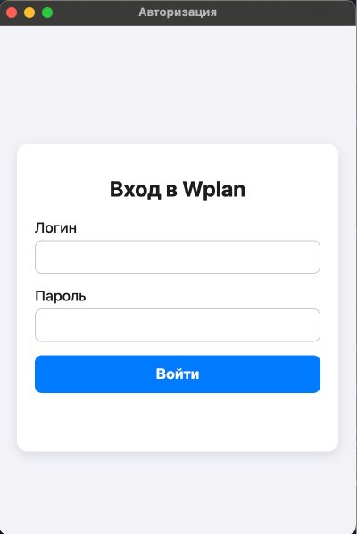
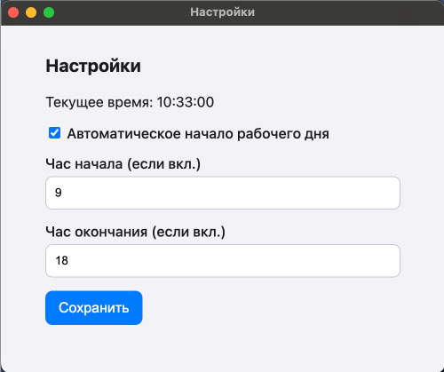

# Wplan Auto

**Wplan Auto** — это кросс-платформенное десктопное приложение для автоматизации входа и учета рабочего времени на внутреннем портале `wplan.office.lan`.

Приложение автоматически сохраняет учетные данные, выполняет вход на сайт и, в зависимости от настроек, может автоматически начинать и завершать рабочий день.

## 🖼️ Скриншоты

| Экран входа | Окно настроек |
| :---: | :---: |
|  |  |

## � Начало работы

### Необходимые утилиты

Для работы с проектом вам понадобится:
- [Node.js](https://nodejs.org/) (рекомендуется версия LTS)
- NPM (обычно устанавливается вместе с Node.js)

### Установка зависимостей

1.  Клонируйте репозиторий или скачайте архив с проектом.
2.  Перейдите в корневую директорию проекта `wplan-auto-forge`.
3.  Выполните команду в терминале для установки всех необходимых зависимостей:
    ```bash
    npm install
    ```

## 🛠️ Использование

### Запуск в режиме разработки

Для запуска приложения в режиме разработки с возможностью отладки и автоматической перезагрузкой при изменениях в коде, выполните команду:

```bash
npm run start
```

### Сборка приложения

Чтобы собрать установочные файлы для вашей операционной системы, используйте команду:

```bash
npm run make
```

-   На **macOS** будет создан установочный файл `.dmg` и `.zip` архив.
-   На **Windows** будет создан установщик `.exe`.
-   На **Linux** будут созданы пакеты `.deb` и `.rpm`.

Готовые файлы для установки вы найдете в директории `out/make`.

## ⚙️ Функционал и Настройки

После первого входа приложение сохранит ваши учетные данные. При последующих запусках оно будет пытаться войти на сайт автоматически.

### Меню

В главном окне приложения доступно плавающее меню:
-   **Настройки**: Открывает окно настроек.
-   **Выход**: Удаляет сохраненные учетные данные и возвращает на экран входа.

### Настройки

В окне настроек доступны следующие опции:
-   **Автоматическое начало рабочего дня**: Если опция включена, приложение будет автоматически нажимать кнопки "Начать" и "Завершить" рабочий день.
-   **Час начала**: Устанавливает час, в который будет нажата кнопка "Начать рабочий день".
-   **Час окончания**: Устанавливает час, в который будет нажата кнопка "Завершить рабочий день".
-   **Текущее время системы**: Отображается для удобства.

## 📁 Структура проекта

-   `src/main/`: Исходный код основного процесса Electron.
    -   `index.js`: Главная точка входа приложения.
    -   `windows.js`: Модуль для создания и управления окнами.
    -   `scheduler.js`: Модуль с логикой планировщика задач.
    -   `ipcHandlers.js`: Модуль для обработки IPC-событий.
-   `src/preload/`: Скрипты предварительной загрузки для окон.
-   `src/assets/`: Статические файлы (HTML, CSS, иконки).
